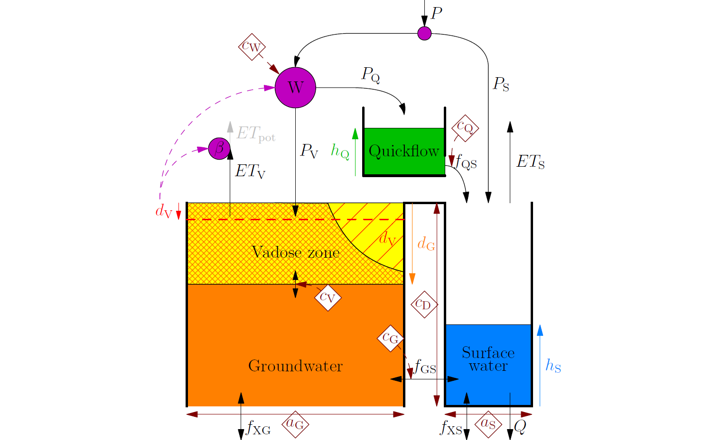
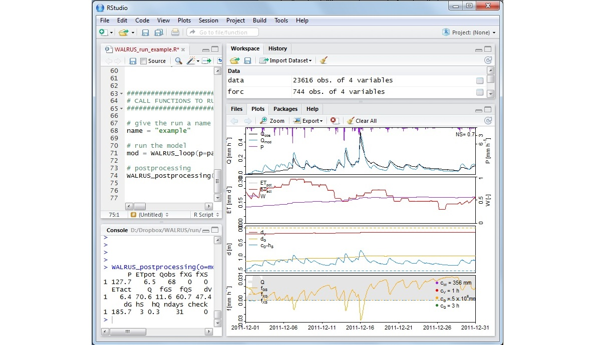
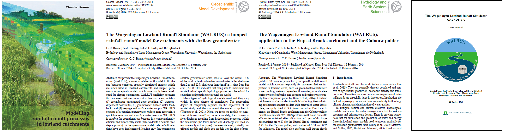
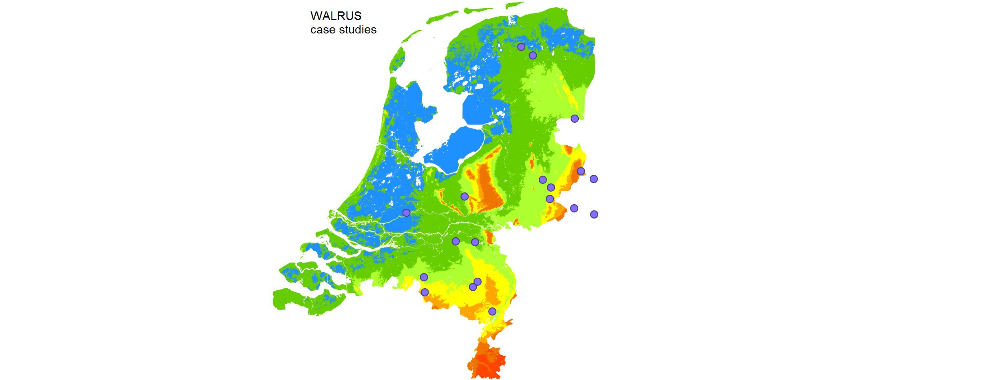
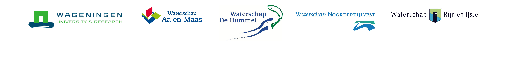

The Wageningen Lowland Runoff Simulator (WALRUS): a lumped rainfall-runoff model for catchments with shallow groundwater
------

The Wageningen Lowland Runoff Simulator (WALRUS) is a novel rainfall-runoff model to fill the gap between complex, spatially
distributed models which are often used in lowland catchments and
simple, parametric  (conceptual) models which have mostly been developed for
sloping catchments. WALRUS explicitly accounts for processes
that are important in lowland areas, notably (1)
groundwater-unsaturated zone coupling, (2) wetness-dependent flow
routes, (3) groundwater-surface water feedbacks and (4) seepage and
surface water supply. WALRUS consists of a coupled
groundwater-vadose zone reservoir, a quickflow reservoir and
a surface water reservoir.  WALRUS is suitable for operational use
because it is computationally efficient and numerically stable
(achieved with a flexible time step approach). In the open source
model code default relations have been implemented, leaving only
four parameters which require calibration. For research purposes,
these defaults can easily be changed. 

**Code availability**

The WALRUS code is available as an R-package through this GitHub (WALRUS_1.0.tar.gz). If you want to be kept informed about WALRUS developments, please send me an email (claudia.brauer-at-wur.nl) so I can add you to my WALRUS-update-mailing-list. You can also visit this site from time to time of course.

**Documentation**

WALRUS and its first applications have been published in two peer reviewed, open access, scientific journals:
- C.C. Brauer, A.J. Teuling, P.J.J.F. Torfs, R. Uijlenhoet (2014a): 
The Wageningen Lowland Runoff Simulator (WALRUS): a lumped rainfall-runoff model for catchments with shallow groundwater, 
Geoscientific Model Development, 7, 2313-2332, 
http://www.geosci-model-dev.net/7/2313/2014/gmd-7-2313-2014.pdf .
- C.C. Brauer, P.J.J.F. Torfs, A.J. Teuling, R. Uijlenhoet (2014b): 
The Wageningen Lowland Runoff Simulator (WALRUS): application to the Hupsel Brook catchment and Cabauw polder, 
Hydrology and  Earth System Sciences, 18, 4007-4028,
www.hydrol-earth-syst-sci.net/18/4007/2014/hess-18-4007-2014.pdf .
- C.C. Brauer, A. Overeem, H. Leijnse, R. Uijlenhoet (2016):
The effect of differences between rainfall measurement techniques on groundwater and discharge simulations in a lowland catchment,
Hydrological Processes, 30, 3885–3900,
http://onlinelibrary.wiley.com/doi/10.1002/hyp.10898/epdf .

WALRUS is also part of a PhD thesis:
- C.C. Brauer (2014):
Modelling rainfall-runoff processes in lowland catchments,
PhD thesis, Wageningen University, The Netherlands,
http://edepot.wur.nl/296285 .

For Dutch water managers and engineers:
- Claudia Brauer, Paul Torfs, Ryan Teuling en Remko Uijlenhoet (2016): 
De Wageningen Lowland Runoff Simulator (WALRUS): een snel neerslag-afvoermodel speciaal voor laaglandstroomgebieden,
Stromingen, 22:1, 2-18, http://edepot.wur.nl/390418 .

To facilitate application of WALRUS, we wrote a [user manual](https://github.com/ClaudiaBrauer/WALRUS/blob/master/documentation/WALRUS_manual.pdf), which is provided in the documentation-folder, together with the two papers.

**User contributions**

We would like to add a folder to this GitHub with examples of applications from different users, so we can learn from each other. So, if you used WALRUS, we would be very much interested in your results. In addition, if you have comments or points for improvement of the model or the manual, please let me know (email claudia.brauer-at-wur.nl).

**Copyright**

WALRUS is free software: you can redistribute it and/or modify it under the terms of the GNU General Public License as published by the Free Software Foundation, either version 3 of the License, or (at your option) any later version. This program is distributed in the hope that it will be useful, but WITHOUT ANY WARRANTY; without even the implied warranty of MERCHANTABILITY or FITNESS FOR A PARTICULAR PURPOSE.  See the GNU General Public License for more details. You should have received a copy of the GNU General Public License along with this program.  If not, see http://www.gnu.org/licenses/.

.

**Acknowledgements**

The development and publication of WALRUS has been financially supported by the Hydrology and Quantitative Water Management Group of Wageningen University (The Netherlands - www.hwm.wur.nl) and four Dutch water authorities: Water Board Aa and Maas, Water Board De Dommel, Water Board Noorderzijlvest and Water Board Rijn and IJssel.

