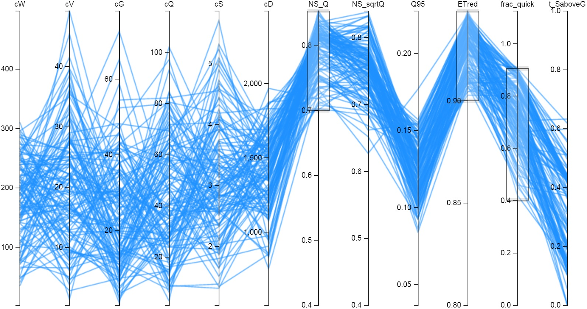

Getting a feel for the parameters: Using interactive parallel plots as a tool for parameter identification
------

**Introduction**

The structure and code of WALRUS are simple, which facilitates detailed investigation of the effect of parameters on all model variables. WALRUS contains only four parameters requiring calibration; they are intended to have a strong, qualitative relation with catchment characteristics. Parameter estimation remains a challenge, however. The model structure contains three main feedbacks: (1) between groundwater and surface water; (2) between saturated and unsaturated zone; (3) between catchment wetness and (quick/slow) flowroute division. These feedbacks represent essential rainfall-runoff processes in lowland catchments, but increase the risk of parameter dependence and equifinality.

Therefore, model performance should not only be judged based on a comparison between modelled and observed discharges, but also based on the plausibility of the internal modelled variables. Here, we present a method to analyse the effect of parameter values on internal model states and fluxes in a qualitative and intuitive way using interactive parallel plotting.

**Method**

WALRUS was run for the Hupsel Brook catchment with 500 parameter sets, which were created using Latin Hypercube Sampling. The model output was characterised in terms of several diagnostics, both measures of goodness of fit and statistics of internal model variables (such as the fraction of discharged water that has travelled through the quickflow reservoir). End users can then eliminate parameter sets with unrealistic signatures based on expert knowledge (and using interactive parallel plots). The resulting selection of realistic parameter sets can be used for ensemble simulations. 

**Interactive parallel plots**

This is an example of an interactive parallel coordinate plot, which can be used to explore the parameter space.

[Click here to go to the interactive version of this plot](http://rawgit.com/ClaudiaBrauer/WALRUS/master/parallel_coordinates/parallel_coordinates_example/index.html)

In this example we varied 6 parameters: 
- *cW*: wetness index parameter
- *cV*: vadose zone relaxation time (the model is not very sensitive to cV)
- *cG*: groundwater reservoir constant
- *cQ*: quickflow reservoir constant
- *cS*: bankfull discharge (only necessary to calibrate when no stage-discharge relation is known)
- *cD*: channel depth (usually not calibrated but based on field estimates)

and we computed 6 diagnostics: 
- *NS Q*: Nash-Sutcliffe efficiency of discharge
- *NS logQ*: Nash-Sutcliffe efficiency of logarithm of discharge 
- *Q95*: 95th percentile of discharge
- *ETred*: Evapotranspiration reduction factor
- *frac quick*: Contribution of quickflow to the total discharge
- *t SaboveG*: Percentage of the time with surface water level above groundwaterwater level

**Examples**

You can use the interactive parallel plot also as help to understand how WALRUS works. Drag the bars and see whan happens to the parameters and diagnostics.

- Which parameters cause much evapotranspiration reduction? Select only low values of ETred. You'll see that these results belong to runs with deep channels (high cD). When channels are deep, groundwater has to become deeper to get the same drainage flux. When groundwater is deep, the top soil is dry. When the top soil is dry, evapotranspiration is reduced.

- Which parameters cause high discharge peaks? Select only high values of Q95. You'll see that these occur with high cW (much water led to quickflow reservoir), low cQ (sharp discharge peaks caused by fast quickflow reservoir) and low cD (shallow channels).

- Which parameters cause surface water infiltration during a large part of the year? Select only high values of t_SaboveG. You'll see that this happens when cD is small (shallow channels, leading to surface water levels close to the soil surface). The parameters cW, cQ and cS do not affect drainage conditions. Drainage conditions are highly correlated with the fraction of quickflow (frac_quick). 
